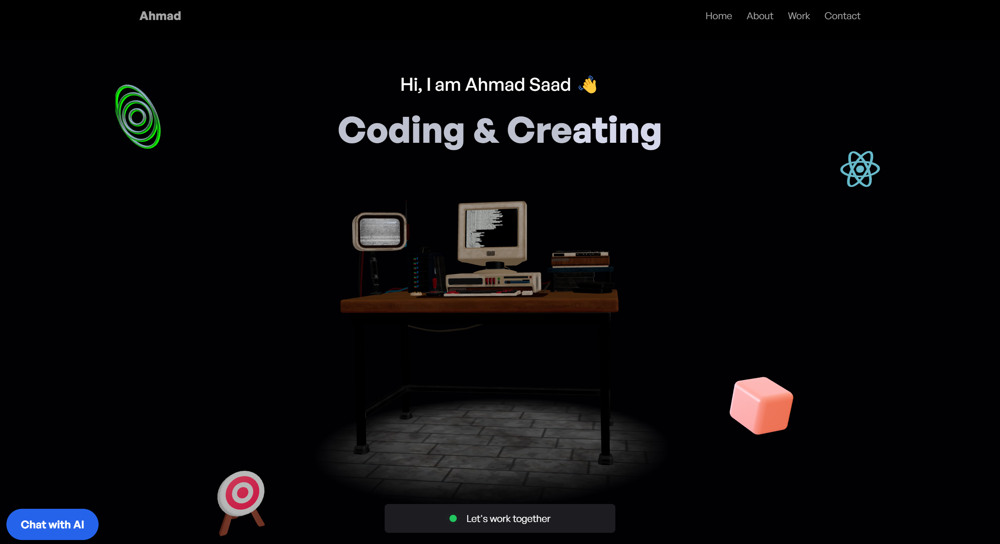

# **🚀 Three.js Portfolio with AI Chatbot**

### 🌍 **Live Demo**

👉 **[Deployed Website](https://kraken57.site/)**

## Demo Video
[](https://www.youtube.com/watch?v=RC1zSKck5lk)
🔗 [Click here to watch the video](https://www.youtube.com/watch?v=RC1zSKck5lk)
---

## 📌 Project Overview

This project is a modern, interactive 3D portfolio website that showcases my work using advanced web technologies. Built with React, Vite, Three.js, and React Three Fiber, it features an AI-powered chatbot using Groq Cloud API for intelligent conversations. The site is deployed on AWS EC2 with a secure HTTPS setup via Let's Encrypt and Nginx.

### 🔹 **Key Features:**

- **3D Interactive Elements 🎨** - Leveraging Three.js and React Three Fiber for dynamic animations.

- **AI Chatbot Integration 🤖** - Powered by Groq Cloud API, enabling intelligent responses.

- **Seamless Email Contact 📩** - Integrated with EmailJS for easy inquiries.

- **Fully Responsive & Optimized 📱** - Ensuring a smooth experience on all devices.

- **Secure & Scalable Deployment ☁️** - Hosted on AWS EC2 with Nginx reverse proxy and Let's Encrypt SSL for secure communication.

This portfolio is designed to provide an engaging experience while demonstrating cutting-edge web technologies.

---

### **🛠️ Tech Stack Used**

### **Frontend:**


### **Backend:**


### **Deployment & Hosting:**


---

### **⚙️ Local Setup**

#### **1️⃣ Clone the Repository**

```sh
 git clone https://github.com/Kraken57/predusk-portfolio.git
 cd predusk-portfolio
```

### **2️⃣ Setup Environment Variables**

Create a `.env` file in both `frontend` and `chatbot-backend` folders.

#### **Frontend (`frontend/.env`)**

```ini
VITE_EMAILJS_USER_ID=your_emailjs_user_id
VITE_EMAILJS_TEMPLATE_ID=your_emailjs_template_id
VITE_EMAILJS_SERVICE_ID=your_emailjs_service_id
VITE_BACKEND_URL=http://localhost:5000
```

#### **Backend (`chatbot-backend/.env`)**

```ini
PORT=5000
GROQ_API_KEY=your_groq_api_key
```

### **3️⃣ Install Dependencies & Start the Project**

#### **Frontend**

```sh
cd frontend
npm install
npm run dev
```

#### **Backend**

```sh
cd chatbot-backend
npm install
node server.js
```

Your chatbot API should now be running on `http://localhost:5000`.

---

### **🚀 Deployment on AWS EC2**

#### **1️⃣ Deploy Backend on AWS EC2**

#### **Launch EC2 Instance**

1. Go to **AWS EC2 Console** → **Launch Instance**.
2. Choose **Ubuntu 22.04 LTS**.
3. Select **t2.micro** (Free Tier Eligible).
4. Configure Security Groups:
   - Allow **Port 22 (SSH)**
   - Allow **Port 443 (HTTPS)**
   - Allow **Port 80 (HTTP)**
5. Click **Launch** and download the `.pem` key.

#### **Connect to EC2 & Setup Backend**

```sh
ssh -i your-key.pem ubuntu@your-ec2-ip
```

```sh
sudo apt update && sudo apt upgrade -y
sudo apt install -y nodejs npm git nginx certbot python3-certbot-nginx
```

#### **Clone & Run the Backend**

```sh
git clone https://github.com/your-username/your-repo.git
cd your-repo/chatbot-backend
npm install
node server.js
```

#### **Keep the Server Running with PM2**

```sh
npm install -g pm2
pm2 start server.js --name chatbot-backend
pm2 save
```

#### **2️⃣ Setup Nginx Reverse Proxy & SSL**

```sh
sudo nano /etc/nginx/sites-available/default
```

Update Nginx config:

```nginx
server {
    listen 80;
    server_name kraken57.site;
    location / {
        proxy_pass http://localhost:5000;
        proxy_http_version 1.1;
        proxy_set_header Upgrade $http_upgrade;
        proxy_set_header Connection 'upgrade';
        proxy_set_header Host $host;
        proxy_cache_bypass $http_upgrade;
    }
}
```

Save and restart Nginx:

```sh
sudo systemctl restart nginx
```

Secure with SSL:

```sh
sudo certbot --nginx -d kraken57.site
```

#### **3️⃣ Connect Frontend & Backend**

Update API URL in **`frontend/src/config.js`**:

```js
const response = await axios.post("/chat", { message: input });
```

Push the changes:

```sh
git add .
git commit -m "Updated API URL"
git push origin main
```

On EC2, pull the changes:

```sh
cd chatbot-backend
git pull origin main
pm install
pm2 restart chatbot-backend
```

---

## **📂 Project Structure**

```
/threejs-portfolio
   ├── frontend (Vite + React + Three.js)
   ├── chatbot-backend (Node.js + Express + Groq API)
```

---

### **🎯 Features**

✅ 3D Portfolio with interactive models 🎨  
✅ AI-powered chatbot 🤖  
✅ Email functionality 📩  
✅ Fully Responsive UI 📱  
✅ AWS EC2 + Nginx Deployment ☁️  

---

### **💡 Future Improvements**

- ✅ Add WebSocket support for chatbot
- ✅ Optimize 3D model loading times

---

### **📬 Contact**

**Ahmad Saad**  
**IIT Roorkee**  
📧 **Email:** ahmad_s@ee.iitr.ac.in

